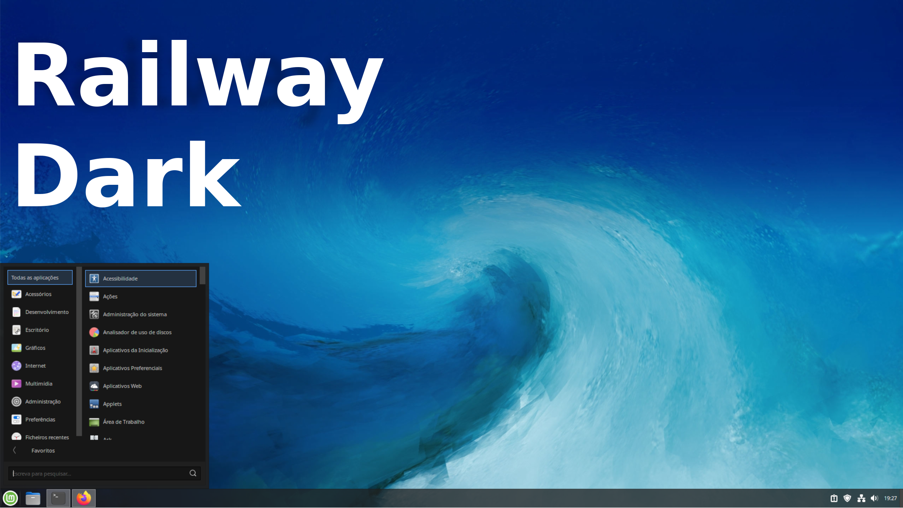

# [Railway Dark Cinnamon theme][repo]
> For those who like _Doors 8_ style, in spite of everything

[][repo]

## Project Focus & Status
The goal of this fork is to bring full **Dark Mode** integration (converting light container backgrounds into matching dark gray tones) and to update the theme to work with newer Cinnamon modules.

### Current State:
* **Grouped Window List:** Fully updated and fixed. Button paddings and minimum widths (`min-width`) have been adjusted so active application icons no longer look squeezed or clipped at the borders.
* **Menu Applets:** The default modern Cinnamon Menu is **not fully functional yet**. I am currently using the **Stark Menu** applet instead of Cinnamon Menu.

## Installation
#### From source
Run `make install` or move the `Railway-Dark` folder into your `~/.themes` folder.

#### Cinnamon Spices
Download it from [here][spices] or search for "Railway-Dark" in your Cinnamon theme settings.

### Color customization
You can get some prebuilt **color variations** from [the repository archive][archive]. You'll have to install them manually by copying the themes into your `~/.themes` folder.

To **create a custom color** variation of the theme you need to install it [from source][repo] in order to get the original code and scripts.
Once you have it run `make color=COLOR`, where `COLOR` is the hexadecimal color without `#`. For example `make color=FF00FF`. Then run `make install`.

---
## Developing
Run `./utils.sh --watch` to automatically compile and reload the theme. It will create a link in `~/.themes`.

_It's important to run utils.sh from its containing directory._

### Contributing
Contributions are accepted via GitHub pull requests [here][repo]. Please, if you modify any image resource, run `./utils.sh --simplify` before creating a commit.

**IMPORTANT**: Never edit CSS files directly. They are overriden at build.

### Build dependencies
* `sassc`: compile sass files
* `inotifywait (inotify-tools)`: watch for changes (optional)
* `scour`: remove svg metadata (optional)

## Credits
Special thanks to [@germanfr](https://github.com/germanfr) for the original Railway Theme codebase (Copyright © 2018) and [@zagortenay333](https://github.com/zagortenay333) for the structural foundation.

Modified, updated, and maintained under the AGPLv3 license by LucasDoCouto (2026).

[repo]: https://github.com/LucasDoCouto/railway-dark-cinnamon
